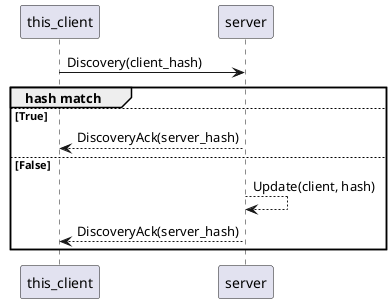

# EventStore

## Setup

run `setup.sh`

## Start webservice

run `start_webservice.sh`

This starts the local EventStore webservice.
The service has to be running for the synchronizer to work.

## Start synchronization

Check if the webservice is running before starting the synchronization service.

run `start_sync.sh`

The first synchronizer service in the network initialized a udp server.
All synchronizers started later will find the server via udp broadcast.
The server maintains a list of all known clients.
TODO: Whenever a client connects to the server, the EventStore status hash is fetched via web api.
TODO: Whenever a client is out of sync with the server there will be a two way sync.

The server stops after 20s and waits for another sync to be started (eg via cron-job) TODO: is this good?

